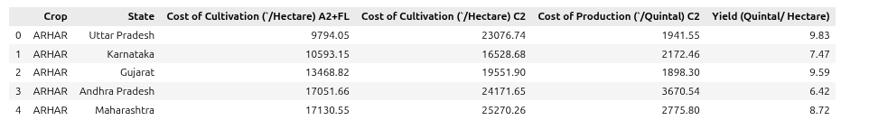
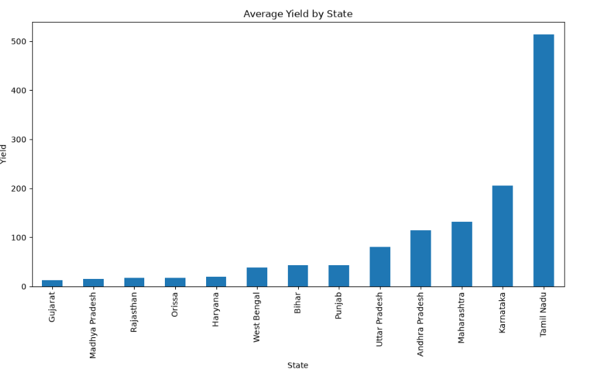
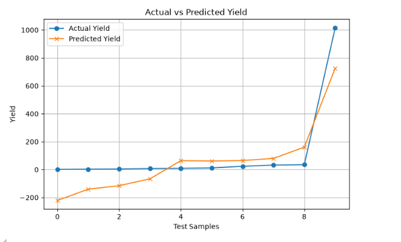

# 🌾 Crop Yield Prediction using Machine Learning

A beginner-friendly Machine Learning project developed as part of my internship to predict crop yield using agricultural production and cultivation cost data.

---

## 📌 Project Overview

The objective of this project is to analyze agricultural data and build a Machine Learning model that predicts crop yield. The project follows the complete ML workflow, including:

- Data Understanding
- Data Cleaning
- Exploratory Data Analysis (EDA)
- Model Training
- Model Evaluation
- Model Comparison
- Model Saving

---

## 🎯 Objectives

- Understand agricultural datasets.
- Clean and preprocess the data.
- Perform Exploratory Data Analysis (EDA).
- Train Machine Learning models.
- Compare model performance.
- Predict crop yield using the best-performing model.

---

## 🛠️ Technologies Used

- Python
- Jupyter Notebook
- Pandas
- NumPy
- Matplotlib
- Scikit-learn
- Joblib
- Git & GitHub

---

## 📂 Project Structure

```text
Crop-Yield-Prediction-ML/
│
├── data/
│   ├── raw/
│   └── processed/
│
├── models/
│   └── crop_yield_prediction_model.pkl
│
├── notebooks/
│   ├── 01_data_understanding.ipynb
│   ├── 02_data_cleaning.ipynb
│   ├── 03_eda.ipynb
│   ├── 04_model_training.ipynb
│   └── 05_model_evaluation.ipynb
│
├── outputs/
│   ├── figures/
│   │   ├── dataset_preview.png
│   │   ├── average_yield_by_state.png
│   │   └── model_prediction.png
│   └── results/
│
├── src/
│   ├── predict.py
│   ├── preprocess.py
│   ├── train.py
│   └── utils.py
│
├── requirements.txt
├── .gitignore
└── README.md
```

---

## 📊 Dataset Information

The dataset contains agricultural information related to different crops and states in India.

### Features

- Crop
- State
- Cultivation Cost (A2+FL)
- Cultivation Cost (C2)
- Production Cost

### Target

- Yield (Quintal/Hectare)

---

# 📸 Project Screenshots

## Dataset Preview



---

## Average Yield by State



---

## Actual vs Predicted Yield



---

# 🤖 Machine Learning Models Used

- Linear Regression
- Decision Tree Regressor

---

# 📈 Model Performance

| Model | MAE | MSE | R² Score |
|------|------:|------:|------:|
| Linear Regression | 116.76 | 19876.70 | **0.78** |
| Decision Tree Regressor | 60.94 | 32128.04 | 0.64 |

**Selected Model:** Linear Regression

Reason:
- Achieved the highest R² Score.
- Suitable for this dataset.
- Easy to understand and interpret.

---

# 📌 Project Workflow

1. Data Understanding
2. Data Cleaning
3. Exploratory Data Analysis (EDA)
4. Feature Preparation
5. Model Training
6. Model Comparison
7. Model Evaluation
8. Save the Best Model

---

# 🚀 Future Improvements

- Train using a larger agricultural dataset.
- Include additional environmental factors such as rainfall, temperature, and soil type.
- Develop a web application for crop yield prediction.
- Experiment with more machine learning algorithms.

---

# 📚 Learning Outcomes

Through this project, I learned:

- Data preprocessing using Pandas
- Exploratory Data Analysis (EDA)
- Data visualization using Matplotlib
- Machine Learning model training
- Model evaluation using MAE, MSE, and R² Score
- Saving trained models using Joblib
- Version control using Git and GitHub

---

# 👨‍💻 Author

**Fardeen Akmal**

Computer Science Engineering Student

Machine Learning Internship Project

GitHub: https://github.com/fardeenakmal
